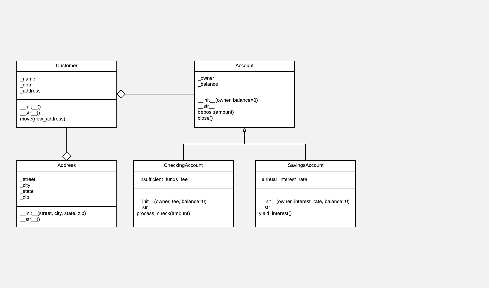

# Form a proper line

Implement classes Address, Customer, Account, CheckingAccount, and SavingsAccount. Your program must be properly formatted (use pylint) and  pass all the tests provided (use pytest).

## General requirements for all classes

* Implement `__init__` and `__str__` methods.

* Implement all data members as properties .

## Class-specific requirements

1. Class *Address* has members `_street`, `_city`, `_state`, `_zip`, and `__eq__`. Two addresses are equal if all 4 properties are equal.

1. Class *Customer* has members `_name`, `_dob`, and `_address`. The `_address` is an object of type *Address*. Customers can change address by invoking method `move`.

1. Class *Account* is **abstract** and has members `_owner` and `_balance`. The `_owner` is an object of type *Customer*. The `_balance` has initial value of 0 and can be changed by invoking methods `deposit` (add money) or `close` (set balance to 0).

1. Class *CheckingAccount* has a member `_insufficient_funds_fee` and method `process_check`. If the account balance is too low to clear the check, the `_insufficient_balance_fee` is subtracted from the balance (note that the balance can be negative).

1. Class *SavingsAccount* has a member `_annual_interest_rate` and method `yield_interest`.
